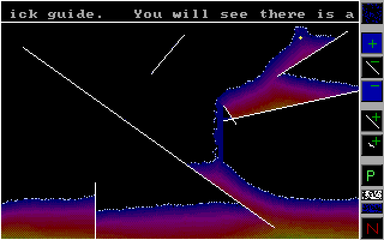

# Slime (DOS)

### About:
Welcome to SLIME! This little program is intended for use as a watery/slimey substance simulator.

### Instructions:
Draw lines with your left mouse button, create fluid with your right mouse button, and use the toolbar on the side screen to make it rain, change mouse button functionality, pause, remove lines or remove water.

You will see there is a panel on the right with buttons on it.  The button at the top is the rain button. Clicking it turns the rain on or off. The next three buttons are your right-click buttons. Use these to decide what you want the simulator to do when you right-click the mouse button.

The next two buttons affect what happens when you left-click the mouse button. So, the button under the rain button (button number 2) adds water when you right-click. This is apparent by the plus in the blue background, which symbolised adding water. Button 3, the button with the minus symbol and a line means removing lines. You can use this to remove any lines you dont want. Button 4 is the button you will use to remove some water in a small area. It's useful for clearing up where the water has messed or spilled. The button under that, button number 5, is the button that you will use to add straight lines to the scene. The button underneath that one is the add freeform line. Use this to 'scribble' lines all over the place.

There are two smaller buttons under that. The white one is used when you want to erase all lines, but keep the water. The blue one is used when you want to erase all water without losing any lines. The larger button underneath (with an N on it) can be used to clear both lines and water at the same time. It will also stop the rain if it was on. You can use 'p' to pause if you dont want to click the button.

To quit the simulation, hit space. Thats it for now. Enjoy yourself.

**DOSBox config:** Set CPU Core to "dynamic" and CPU Cycles to "max" (or run "core=dynamic" and "cycles=max" in the command prompt before running "slime.exe")

### Screenshot:

### Info:
**Created:** 2001

**Operating System:** Dos 6

**Compile with:** Borland Turbo C++ 3.x (make sure your "Options" -> "Directories" paths for "Libraries" and "Includes" are correct)
